# AI Content Factory 逻辑架构与流程规划

## 目标定位

本项目不是单支影片生成器，而是一个 AI Content Operations Factory：

- 上层管理内容策略：系列、世界观、题库、角色、场景、风格。
- 中层管理生产案件：每支影片都是一个 Case。
- 下层管理工具路由：LLM、图片、TTS、BGM、Video、FFmpeg、Storage、YouTube。
- 所有业务数据以 MongoDB 为 source of truth。
- 所有媒体文件进入 Storage，默认本地 `uploads/`，以后可切 GCS。
- 所有外部调用必须走工具设置、记录成本、保留日志。

核心原则：

- 先有内容架构，再有生成流程。
- 先有已确认大纲，再进入图片、配音、视频生产。
- 已选角色和场景必须作为参考资产进入后续生成。
- Case 不负责配置模型；模型只在 Workflow / Tools 管理。
- 自动化最多跑到 MP4 + QC，发布必须等人工审核。

## 1. 总体分层

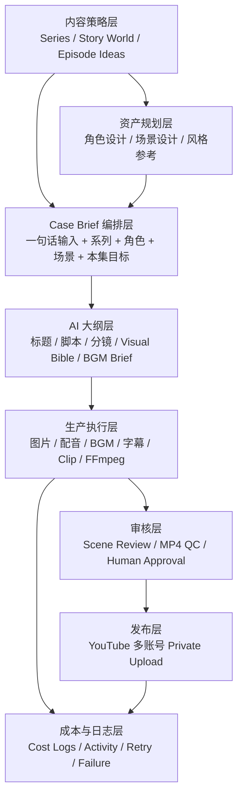

## 2. 核心资料模型

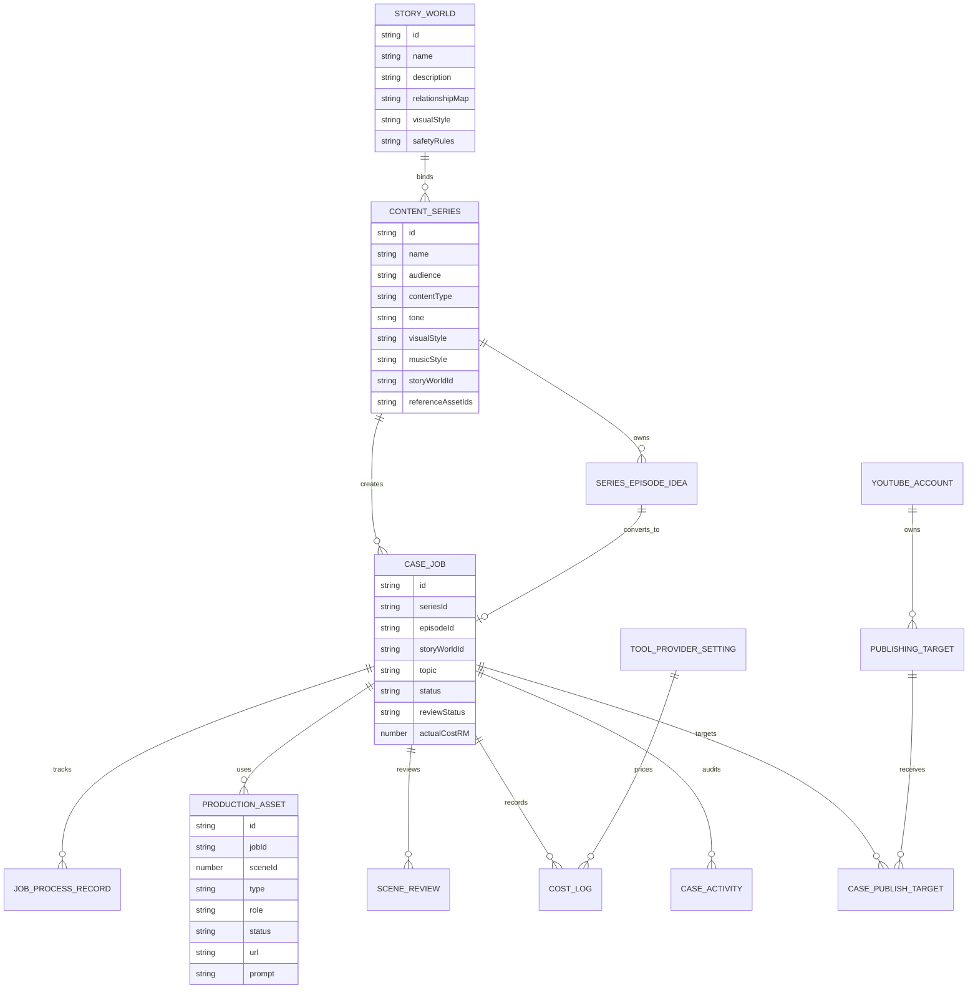

## 3. 内容库到 Case 的流程

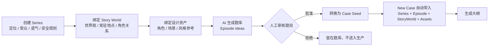

## 4. Case Brief 编排器

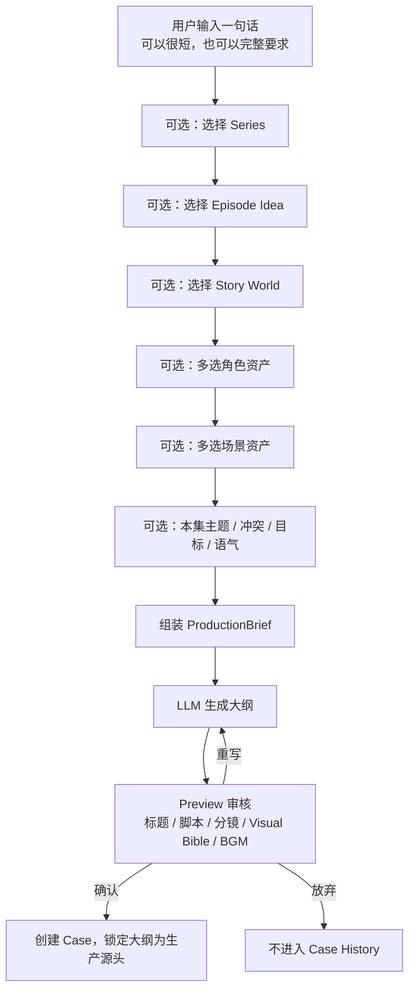

## 5. 已确认大纲作为唯一生产源

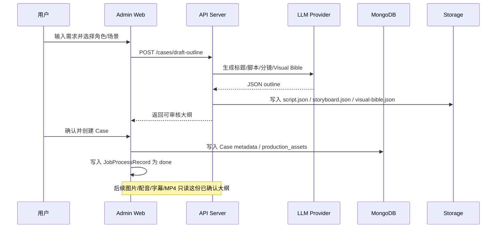

## 6. 资产规划与参考图流

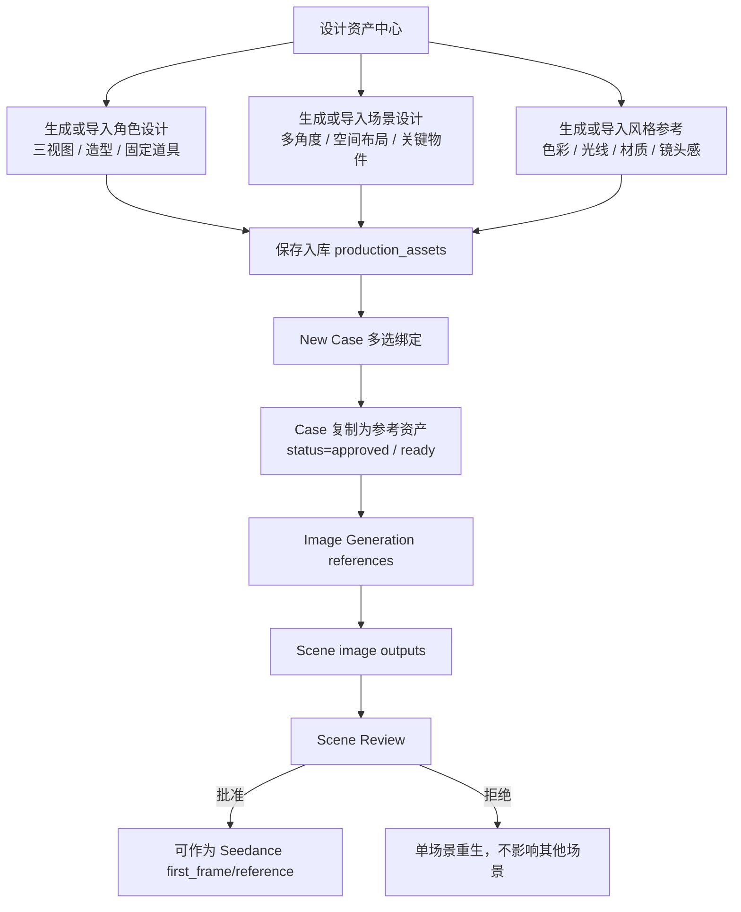

## 7. 生产状态机

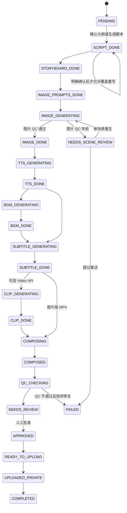

## 8. 工具路由与成本控制

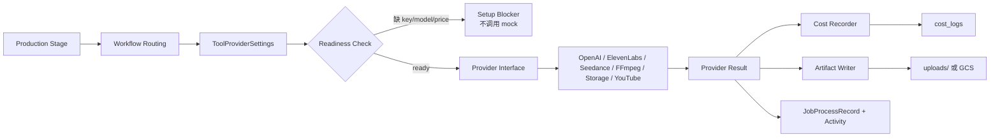

## 9. 自动排程与多账号发布

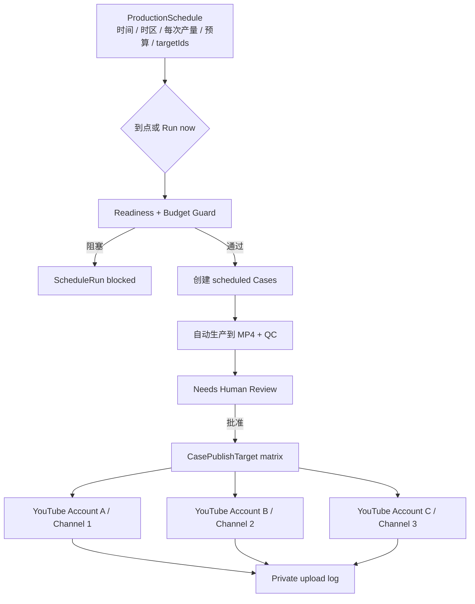

## 10. Admin Web 信息架构

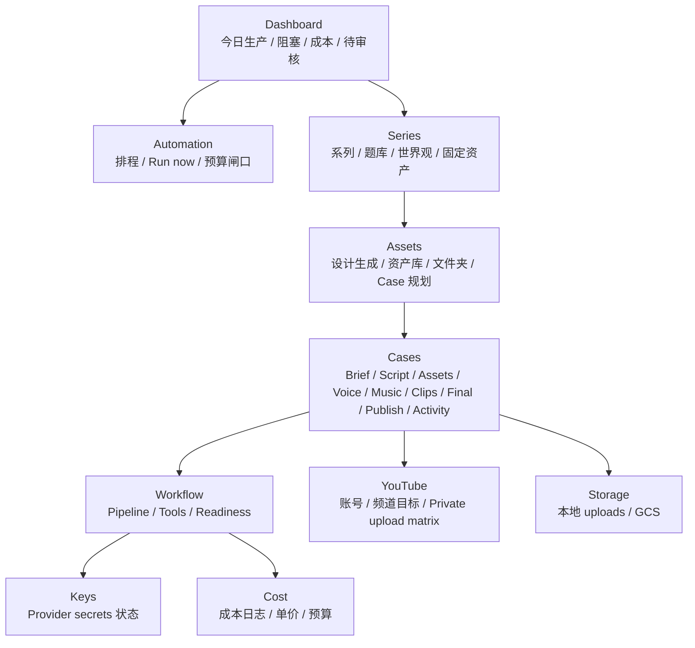

## 11. 正确实施顺序

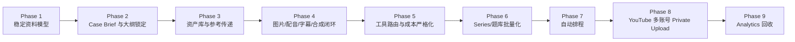

## 下一步开发准则

先按这个顺序收敛：

1. 确认大纲就是 Case 的生产源头，禁止下游重新编故事。
2. 角色、场景、风格参考必须先进入 `production_assets`，再进入图片和视频生成。
3. Case 页面只展示本 Case 的生产状态，不再混入全局模型设置。
4. Workflow / Tools 只管理供应商、模型、单价、是否允许自动调用。
5. Series 是内容库，不是硬编码模板；儿童教育、恐怖、喜剧都只是可配置系列。
6. 自动化只负责创建 Case 和跑到 MP4/QC；发布必须人工批准。

## 近期应该先修的模块

- Case 创建：Preview 确认后锁定脚本、分镜、Visual Bible。
- Case 资产：多选角色/场景必须完整绑定并传给生图。
- Assets 页签：改成参考资产、场景审核、产物摘要三段式。
- Series 页：题库转 Case 必须带入 Series、StoryWorld、角色、场景。
- Workflow Tools：所有模型/单价/endpoint 统一配置，不在 Case 内散落。
